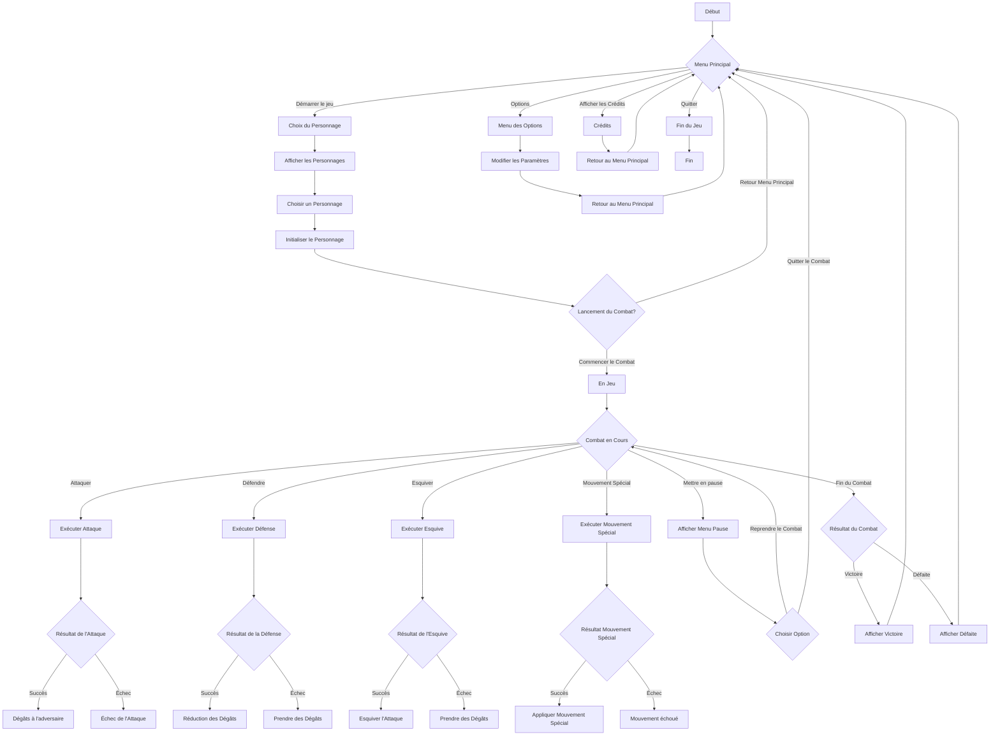

```mermaid
flowchart TD
    A[Début] --> B{Menu Principal}
    
    %% Menu principal options
    B --> |"Démarrer le jeu"| C[Choix du Personnage]
    B --> |"Options"| D[Menu des Options]
    B --> |"Afficher les Crédits"| E[Crédits]
    B --> |"Quitter"| F[Fin du Jeu]

    %% Choix du personnage
    C --> G[Afficher les Personnages]
    G --> H[Choisir un Personnage]
    H --> I[Initialiser le Personnage]
    I --> J{Lancement du Combat?}
    
    J --> |"Retour Menu Principal"| B
    J --> |"Commencer le Combat"| K[En Jeu]

    %% Menu des options
    D --> L[Modifier les Paramètres]
    L --> M[Retour au Menu Principal]
    M --> B
    
    %% Afficher les crédits
    E --> N[Retour au Menu Principal]
    N --> B

    %% En Jeu - Le combat
    K --> O{Combat en Cours}
    O --> |"Attaquer"| P[Exécuter Attaque]
    O --> |"Défendre"| Q[Exécuter Défense]
    O --> |"Esquiver"| R[Exécuter Esquive]
    O --> |"Mouvement Spécial"| S[Exécuter Mouvement Spécial]
    O --> |"Mettre en pause"| T[Afficher Menu Pause]

    %% Actions du joueur et de l'adversaire
    P --> U{Résultat de l'Attaque}
    U --> |"Succès"| V[Dégâts à l'adversaire]
    U --> |"Échec"| W[Échec de l'Attaque]

    Q --> X{Résultat de la Défense}
    X --> |"Succès"| Y[Réduction des Dégâts]
    X --> |"Échec"| Z[Prendre des Dégâts]

    R --> AA{Résultat de l'Esquive}
    AA --> |"Succès"| AB[Esquiver l'Attaque]
    AA --> |"Échec"| AC[Prendre des Dégâts]

    S --> AD{Résultat Mouvement Spécial}
    AD --> |"Succès"| AE[Appliquer Mouvement Spécial]
    AD --> |"Échec"| AF[Mouvement échoué]

    %% Menu pause
    T --> AG{Choisir Option}
    AG --> |"Reprendre le Combat"| O
    AG --> |"Quitter le Combat"| B

    %% Résultat du combat
    O --> |"Fin du Combat"| AH{Résultat du Combat}
    AH --> |"Victoire"| AI[Afficher Victoire]
    AH --> |"Défaite"| AJ[Afficher Défaite]
    AI --> B
    AJ --> B

    F --> AK[Fin]
```
