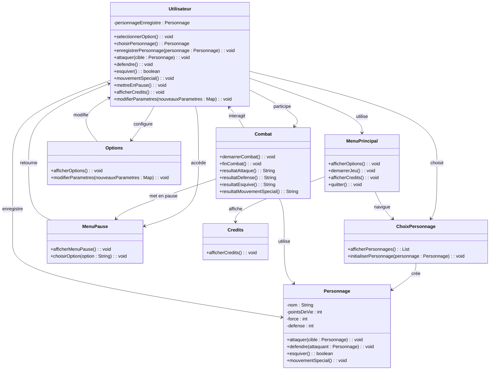

```mermaid
classDiagram
    class Utilisateur {
        -personnageEnregistre : Personnage
        +selectionnerOption() : void
        +choisirPersonnage() : Personnage
        +enregistrerPersonnage(personnage : Personnage) : void
        +attaquer(cible : Personnage) : void
        +defendre() : void
        +esquiver() : boolean
        +mouvementSpecial() : void
        +mettreEnPause() : void
        +afficherCredits() : void
        +modifierParametres(nouveauxParametres : Map<String, Object>) : void
    }

    class MenuPrincipal {
        +afficherOptions() : void
        +demarrerJeu() : void
        +afficherCredits() : void
        +quitter() : void
    }

    class ChoixPersonnage {
        +afficherPersonnages() : List<Personnage>
        +initialiserPersonnage(personnage : Personnage) : void
    }

    class Personnage {
        -nom : String
        -pointsDeVie : int
        -force : int
        -defense : int
        +attaquer(cible : Personnage) : void
        +defendre(attaquant : Personnage) : void
        +esquiver() : boolean
        +mouvementSpecial() : void
    }

    class Combat {
        +demarrerCombat() : void
        +finCombat() : void
        +resultatAttaque() : String
        +resultatDefense() : String
        +resultatEsquive() : String
        +resultatMouvementSpecial() : String
    }

    class MenuPause {
        +afficherMenuPause() : void
        +choisirOption(option : String) : void
    }

    class Options {
        +afficherOptions() : void
        +modifierParametres(nouveauxParametres : Map<String, Object>) : void
    }

    class Credits {
        +afficherCredits() : void
    }

    %% Relations
    Utilisateur --> MenuPrincipal : utilise
    Utilisateur --> ChoixPersonnage : choisit
    Utilisateur --> Combat : participe
    Utilisateur --> MenuPause : accède
    Utilisateur --> Options : configure
    MenuPrincipal --> ChoixPersonnage : navigue
    MenuPrincipal --> Credits : affiche
    Combat --> Utilisateur : interagit
    Combat --> MenuPause : met en pause
    MenuPause --> Utilisateur : retourne
    Options --> Utilisateur : modifie
    ChoixPersonnage --> Personnage : crée
    Combat --> Personnage : utilise
    Utilisateur --> Personnage : enregistre
```
