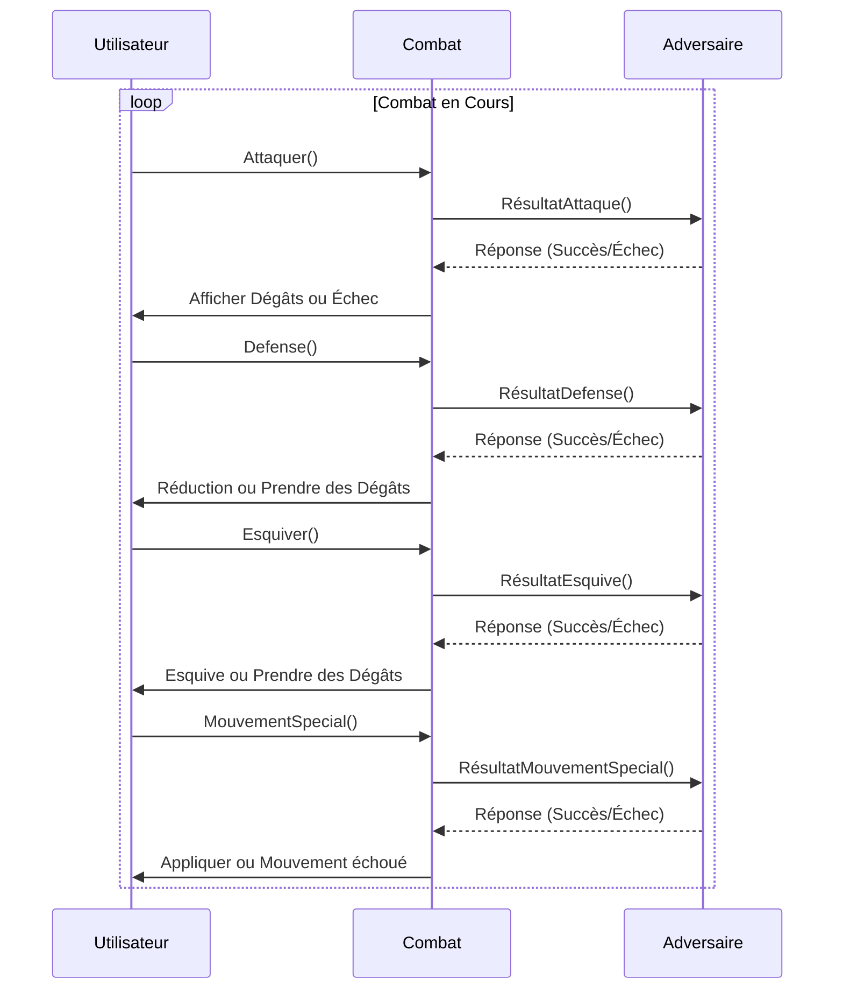

```mermaid
sequenceDiagram
    Participant Utilisateur
    Participant Combat
    Participant Adversaire

    loop Combat en Cours
        Utilisateur->>Combat: Attaquer()
        Combat->>Adversaire: RésultatAttaque()
        Adversaire-->>Combat: Réponse (Succès/Échec)
        Combat->>Utilisateur: Afficher Dégâts ou Échec

        Utilisateur->>Combat: Defense()
        Combat->>Adversaire: RésultatDefense()
        Adversaire-->>Combat: Réponse (Succès/Échec)
        Combat->>Utilisateur: Réduction ou Prendre des Dégâts

        Utilisateur->>Combat: Esquiver()
        Combat->>Adversaire: RésultatEsquive()
        Adversaire-->>Combat: Réponse (Succès/Échec)
        Combat->>Utilisateur: Esquive ou Prendre des Dégâts

        Utilisateur->>Combat: MouvementSpecial()
        Combat->>Adversaire: RésultatMouvementSpecial()
        Adversaire-->>Combat: Réponse (Succès/Échec)
        Combat->>Utilisateur: Appliquer ou Mouvement échoué
    end
```
