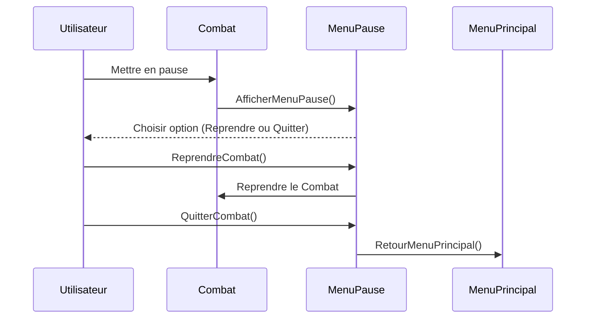

```mermaid
sequenceDiagram
    Participant Utilisateur
    Participant Combat
    Participant MenuPause
    Participant MenuPrincipal

    Utilisateur->>Combat: Mettre en pause
    Combat->>MenuPause: AfficherMenuPause()
    MenuPause-->>Utilisateur: Choisir option (Reprendre ou Quitter)
    Utilisateur->>MenuPause: ReprendreCombat()
    MenuPause->>Combat: Reprendre le Combat

    Utilisateur->>MenuPause: QuitterCombat()
    MenuPause->>MenuPrincipal: RetourMenuPrincipal()
```
